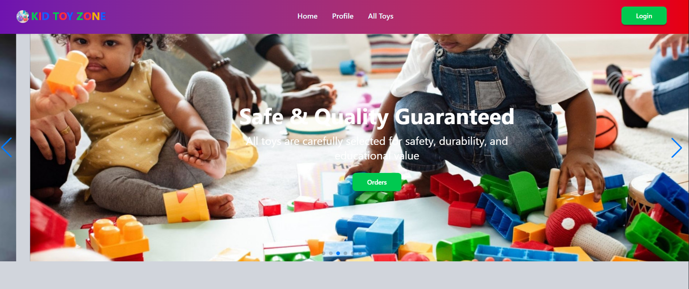

# KID TOY ZONE
A modern toy marketplace web app for discovering toys, viewing details, and managing orders with secure user authentication.

---
## About the Project
KID TOY ZONE is a responsive React-based toy marketplace built to help families explore popular toys and interact with local toy sellers. It focuses on user-friendly browsing, protected routes, and smooth account and order experiences using Firebase Authentication.

---

## Project Overview
- Objective: Build an engaging toy marketplace UI with authentication and route-based access control.
- Catalog Source: Local JSON (`public/toys_data.json`) rendered dynamically.
- Authentication: Firebase Email/Password and Google Sign-In.
- Core User Flows: Browse toys, view toy details, submit toy trial/order request, manage profile, and track/delete orders.

You can add a project screenshot or UI diagram here:

```md

```

---

## Key Features
- Dynamic Toy Listing - Loads toy data from JSON and displays a popular toys grid.
- Toy Details and Trial Request - View full toy info and submit a "Try This Toy Now" request.
- Authentication System - Register, login, Google sign-in, and password reset with Firebase.
- Protected Routes - Restricts toy details, profile, and orders pages to authenticated users.
- Order Management - Add toy requests to "My Orders" and remove them with confirmation.
- Profile Page - Displays user info including last sign-in metadata.
- Enhanced UX - Swiper hero slider, loading states, AOS animation, and toast notifications.

---

## Tech Stack
**Frontend:** React 19, React Router 7, Tailwind CSS 4, DaisyUI  
**Authentication:** Firebase Auth  
**UI/UX:** Swiper, React Icons, React Hot Toast, AOS  
**Build Tools:** Vite, ESLint, npm

---

## Dependencies
Major libraries used in this project:

```json
{
  "react": "^19.2.0",
  "react-dom": "^19.2.0",
  "react-router-dom": "^7.9.4",
  "firebase": "^12.4.0",
  "tailwindcss": "^4.1.16",
  "daisyui": "^5.3.9",
  "swiper": "^12.0.3",
  "react-hot-toast": "^2.6.0",
  "react-icons": "^5.5.0",
  "aos": "^2.3.4"
}
```

---

## Installation & Setup
1. Clone the repository and install dependencies:

```bash
git clone https://github.com/your-username/kid-toy-zone.git
cd KID-TOY-ZONE
npm install
```

2. Configure Firebase environment variables in a `.env` file:

```env
VITE_FIREBASE_API_KEY=your_api_key
VITE_FIREBASE_AUTH_DOMAIN=your_auth_domain
VITE_FIREBASE_PROJECT_ID=your_project_id
VITE_FIREBASE_STORAGE_BUCKET=your_storage_bucket
VITE_FIREBASE_MESSAGING_SENDER_ID=your_sender_id
VITE_FIREBASE_APP_ID=your_app_id
```

3. Run the app locally:

```bash
npm run dev
```

4. Build for production:

```bash
npm run build
```

---

## Folder Structure

```plaintext
KID TOY ZONE/
|
+-- public/
|   +-- slider.json
|   +-- toys_data.json
+-- src/
|   +-- assets/
|   +-- Components/
|   +-- firebase/
|   +-- Layout/
|   +-- Pages/
|   |   +-- Auth/
|   |   +-- ErrorPage/
|   |   +-- ExtraRoute/
|   |   +-- Home/
|   |   +-- Profile/
|   |   +-- Toys/
|   +-- Provider/
|   +-- Routes/
|   +-- index.css
|   +-- main.jsx
+-- .env
+-- package.json
+-- vite.config.js
```

---


## License
Distributed under the MIT License. See `LICENSE` for more information.

---

## Contact
**Live URL:** [Live Site](https://kid-toy-zone.web.app/)  
**Email:** [username](shihabkhanahab@gmail.com)  
**Portfolio:** [Portfolio](https://shehabislam99.netlify.app/)
